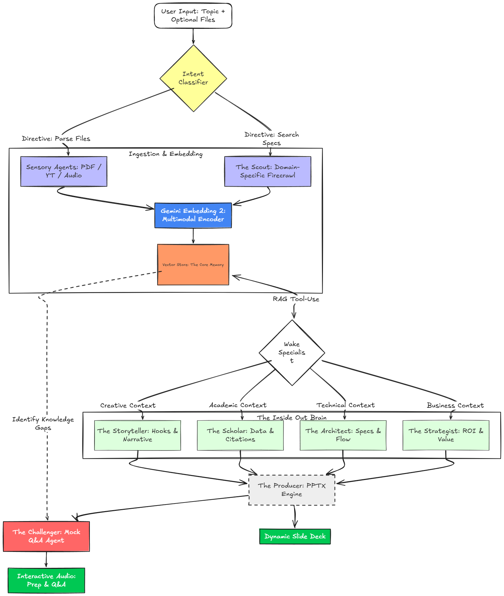

# PowerPointLess

**PowerPointLess** is an autonomous, multi-agent presentation agency powered by Google Gemini. Give it a topic, it researches, reasons, builds the slides, and stress-tests them with a mock Q&A session.

## Demo

<video src="https://github.com/user-attachments/assets/afc8d9df-1d33-488d-84a9-b368b3b88a67" controls width="100%"></video>

## Architecture



The pipeline runs through four phases: **intent classification** → **multimodal research & ingestion** → **specialist agent reasoning** → **deck production + challenger Q&A**. Each phase is handled by a dedicated agent : The Scout, The Architect/Strategist/Scholar/Storyteller, The Producer, and The Challenger.

## Agent Roster

| Agent | Role |
|-------|------|
| **Gemini Classifier** | Routes topic to `technical / business / academic / creative` |
| **The Scout** | Firecrawl-powered web research across 5 auto-generated queries |
| **Sensory Service** | Ingests PDFs, images, audio, video, YouTube, and web URLs |
| **The Architect** | Technical specialist : systems, tradeoffs, specs |
| **The Strategist** | Business specialist : market, ROI, executive framing |
| **The Scholar** | Academic specialist : rigor, citations, methodology |
| **The Storyteller** | Creative specialist : narrative, emotion, visual impact |
| **The Producer** | Builds the 8-slide deck blueprint from the specialist brief |
| **The Challenger** | Generates 6 ranked mock Q&A questions from knowledge gaps |
| **PPTX Builder** | Renders main deck + speaker notes deck as `.pptx` files |

## Tech Stack

| Layer | Technology |
|-------|-----------|
| Backend | FastAPI + Uvicorn |
| AI (generation) | Gemini 2.5 Flash |
| AI (embeddings) | Gemini Embedding 2.0 Flash Preview |
| Vector store | Qdrant |
| Web research | Firecrawl |
| Slide rendering | python-pptx |
| Frontend | React 18 + Vite |

## API

| Method | Endpoint | Description |
|--------|----------|-------------|
| `POST` | `/api/presentations/intake` | Research a topic and load memory |
| `POST` | `/api/presentations/generate` | Generate full deck (auto-researches if needed) |
| `GET` | `/api/presentations/download/{filename}` | Download generated `.pptx` |
| `GET` | `/health` | Health check |

Interactive docs at **`http://localhost:8000/docs`**.

## Getting Started

### Prerequisites

- [Docker Desktop](https://www.docker.com/products/docker-desktop/) ≥ 24

### 1. Set up environment

```bash
cp Backend/.env.example Backend/.env
# Fill in GEMINI_API_KEY and FIRECRAWL_API_KEY
```

### 2. Run

```bash
docker compose -f docker-compose.dev.yml up --build
```

| Service | URL |
|---------|-----|
| Frontend | http://localhost:5173 |
| Backend | http://localhost:8000 |
| API Docs | http://localhost:8000/docs |
| Qdrant | http://localhost:6333/dashboard |

> Hot-reload is enabled for both frontend and backend — no rebuilds needed during development.

```bash
# Stop
docker compose -f docker-compose.dev.yml down

# Stop + wipe vector data
docker compose -f docker-compose.dev.yml down -v
```

<details>
<summary>Manual setup (without Docker)</summary>

**Qdrant**
```bash
docker compose -f docker-compose.qdrant.yml up -d
```

**Backend**
```bash
cd Backend
python -m venv .venv && source .venv/bin/activate  # Windows: .venv\Scripts\activate
pip install -r requirements.txt
uvicorn app.main:app --reload
```

**Frontend**
```bash
cd Frontend && npm install && npm run dev
```

</details>
